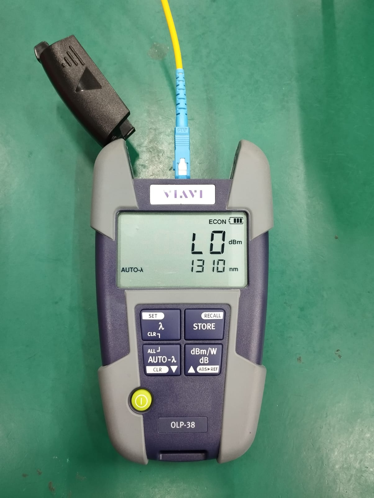
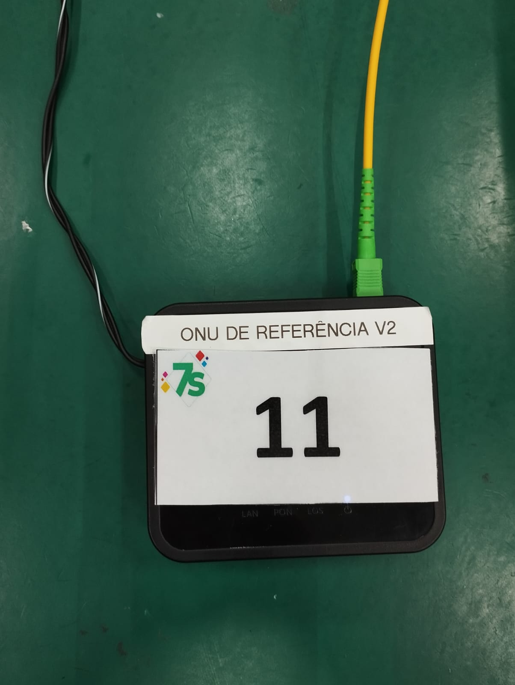
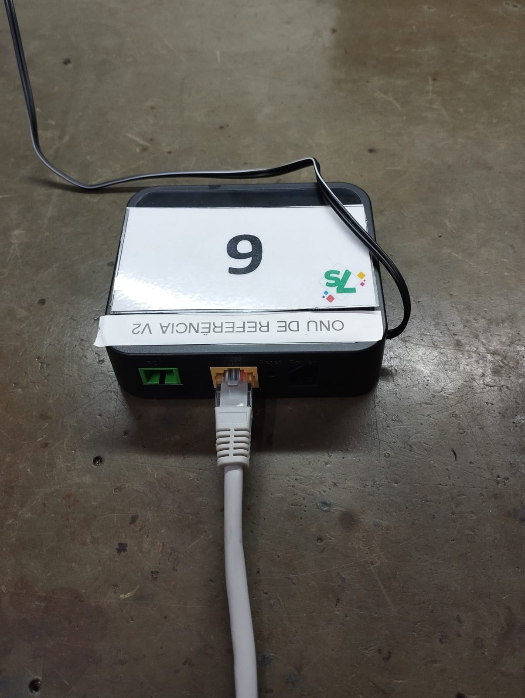
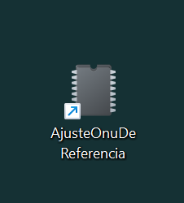

<h4 align="center"> 
    :construction:  Projeto em construção  :construction:
</h4>

# Ajuste ONU de referência

O que é uma ONU de referência? Antes de falar sobre ela, primeiro é necessário entender o que é uma ONU.

Uma ONU (Optical Network Unit) é um equipamento que recebe o sinal da internet do provedor (via OLT) e o transforma em impulsos elétricos. De forma simplificada, é um dispositivo que usamos para transformar sinais de fibra óptica em ethernet para uso doméstico.

A ONU de referência é um equipamento usado para configuração, onde utilizamos a mesma para configurar os cenários de teste e calibração. O que ela configura? De forma simples, a ONU serve para fornecer um valor padrão para os cenários, sendo esse valor entre 1,90 a 2,10 dBm.

## Qual o motivo da criação desse programa?

    Esse programa permite que qualquer pessoa consiga ajustar o valor da ONU de referência, algo que até então somente pessoas com formações técnicas poderiam fazer. Com este software, não será necessário a intervenção da manutenção, engenharia ou P&D.

# Materiais necessário para o ajuste

Para realizar o ajuste serão necessários os seguintes itens:

    - Cabo RJ-45 (para fazer a conexão com a ONU)
    - Notebook ou computador
    - ONU de referência (a que terá o valor alterado)
    - Cordão de fibra óptica
    - Power meter (para medir a potência da ONU)


## Como fazer o ajuste

Primeiramente deve-se medir a ONU de referência. Para isso, coloque o power meter na faixa de 1310 nm, depois conecte o lado azul do cordão de fibra no power meter e o lado verde na ONU que deseja medir. Se o valor estiver fora de 1,90 a 2,10 dBm, será necessário fazer ajuste na mesma.


<div align="center">
    
    
</div>

Para fazer o ajuste, conecte o cabo RJ-45 no computador ou notebook e depois na ONU de referência (como a ONU de referência segue o IP 192.168.1.1, você deve configurar a sua porta de rede para a mesma faixa).

<div align="center">
    
</div>

Depois, abra o nosso programa e siga o passo a passo descrito na tela (para abrir o programa, siga o passo "Rodando projeto").

<div align="center">
    
</div>

## 🛠️ Rodando projeto

Clone o projeto

```bash
  git clone https://github.com/kakasten/AjusteOnuDeReferencia
```

Instale Rust e Cargo

```bash
  curl https://sh.rustup.rs -sSf | sh
```

Entre no diretório do projeto

```bash
  cd AjusteOnuDeReferencia
```

Compile o projeto 

```bash
  cargo build
```

Inicie o .exe

```bash
  cargo run
  ```

## ✔️ Técnicas e tecnologias utilizadas

- ``Rust``
- ``Visual Studio Code``
- ``Cargo 1.78``
- ``Paradigma de orientação a objetos``
- ``Librarie SSH2``
- ``Librarie Log4rs``

## 📁 Acesso ao projeto
Você pode acessar os arquivos do projeto clicando [aqui](https://github.com/kakasten/AjusteOnuDeReferencia/tree/master/src).

## Desenvolvedores
| [<br><sub>Kakasten</sub>](https://github.com/kakasten) |
| :---: |